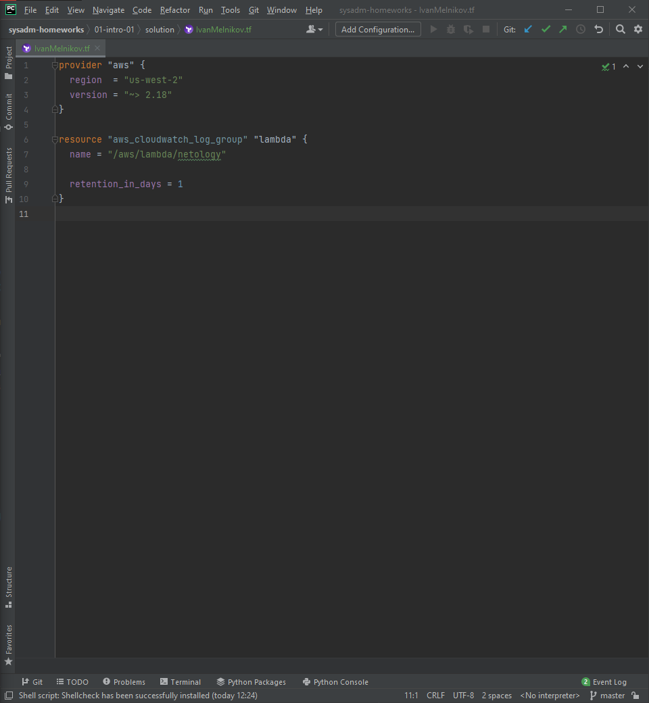
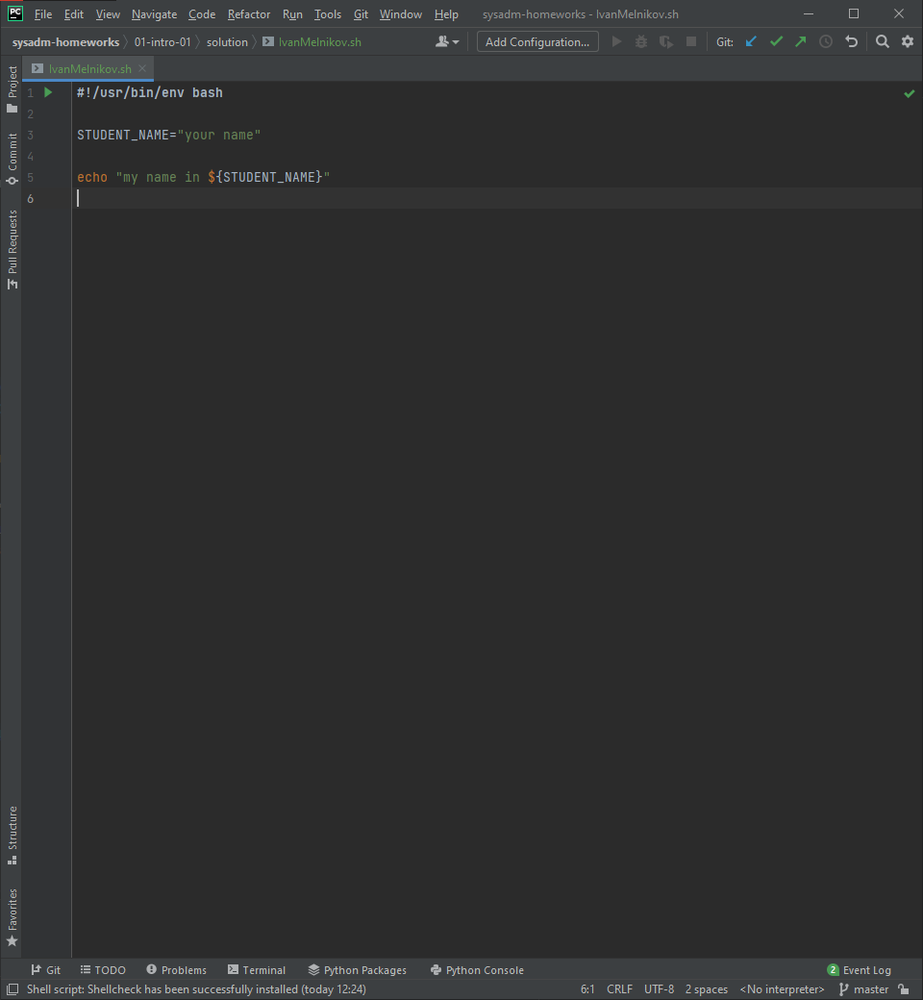
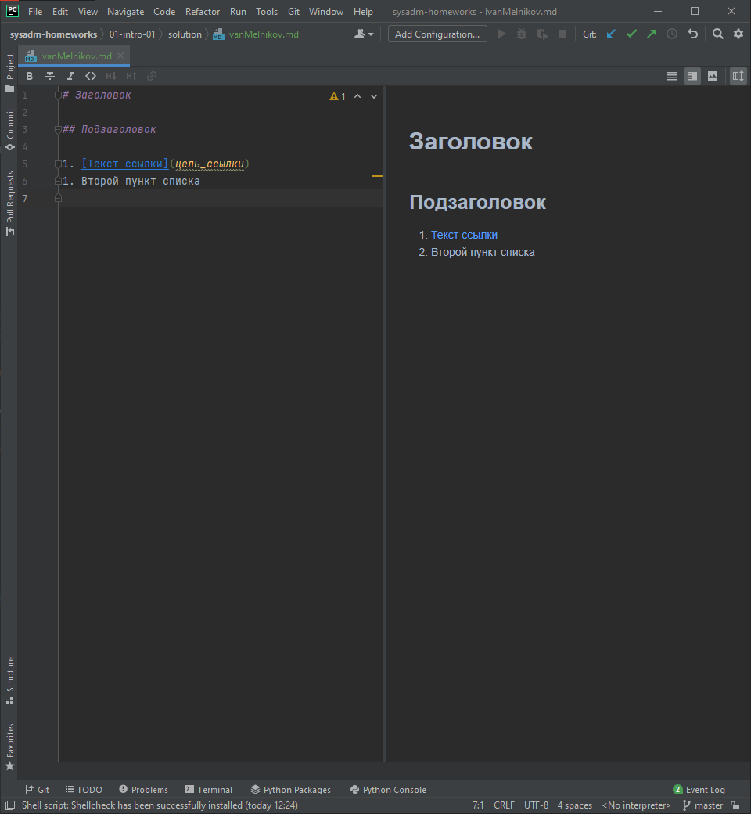
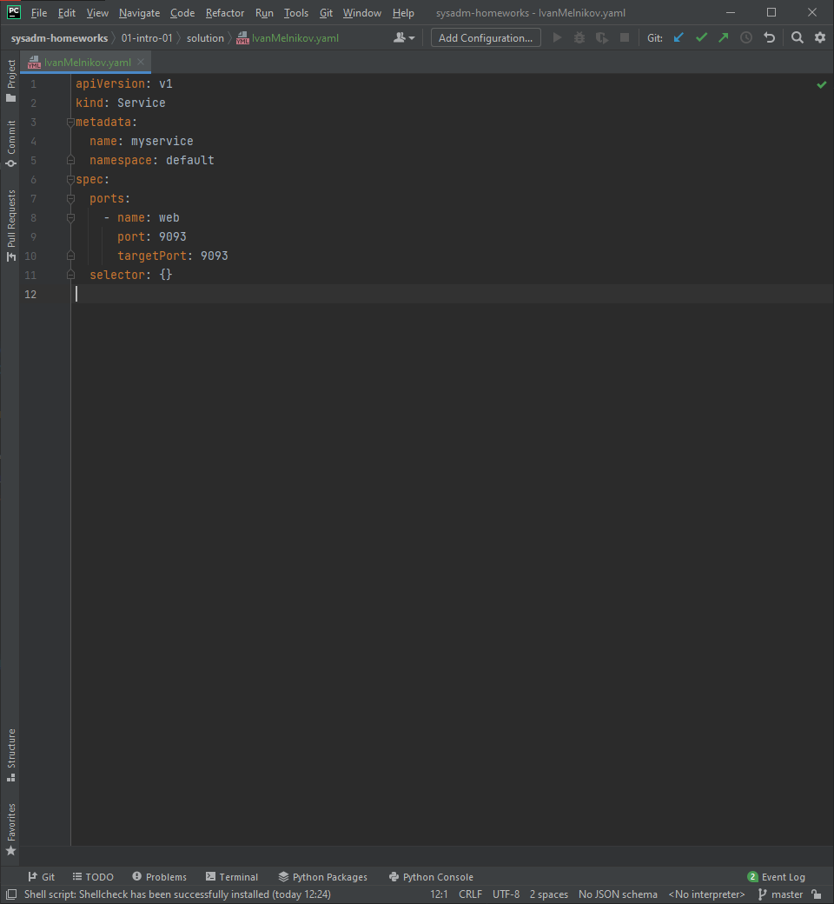
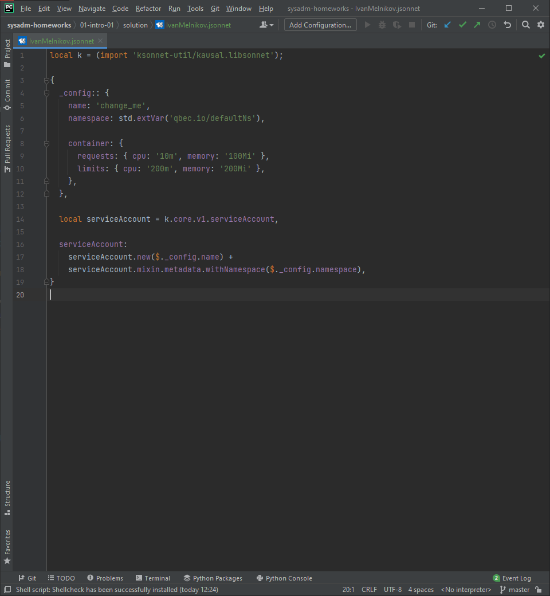

# «1.1. Введение в DevOps» - Иван Мельников - DEVSYS-9

## Задание №1 - Подготовка рабочей среды
Изображения с настроенными плагинами:  
- Terraform:  
  
- Bash:  
  
- Markdown:  
  
- Yaml:  
  
- Jsonnet:  
  

## Задание №2 - Описание жизненного цикла задачи (разработки нового функционала)

Процесс решения задачи (*Менеджер*, *Разработчик*, *Тестировщик*, *DevOps*):
1. Сбор требований от клиента:  
   ***Менеджер*** собирает требования по задаче со стороны клиента, описывает ее и передает на анализ и оценку команде.
2. Оценка задачи, определения приоритета:  
   Команда определяет оптимальный способ реализации, производит оценку, а также определяет приоритет, для включения в план разработки.
3. Разработка функциональности:  
   ***Разработчик*** реализовывает согласно определенному плану, необходимую функциональность, в процессе привлекая ***DevOps*** для создания специфического окружения, в случае необходимости.
4. Тестирование функциональности:  
   ***Тестировщик*** размещает решение на тестовой среде и производит тестирование, также привлекая ***DevOps*** если это требуется.
 В результате тестирования, решение передается либо на доработку Разработчику, с перечнем замечаний, либо на размещение в рабочее окружение DevOps.
5. Размещение функциональности:  
   ***DevOps*** переносит решение на рабочее окружение.
6. Получение обратной связи от клиента:  
   ***Менеджер*** производит презентацию клиенту, получает обратную связь, и в случае необходимости, регистрирует новые задачи.